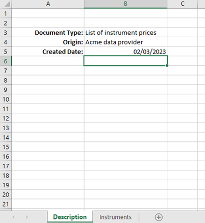
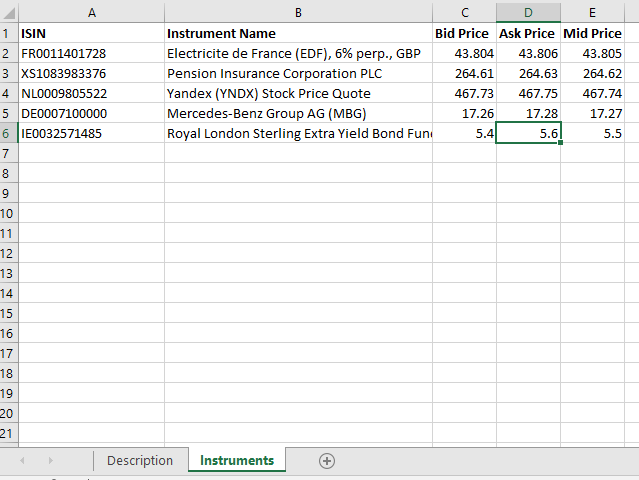


The ExcelBridge package converts an xlsx file from/to a set of POCO objects. 

Let us suppose we have a spreadsheet like: 

 

Tab 1: 
  


 

Tab 2: 
  
 

 

A code like: 

 
```cs
public class InstrumentPricesWorkbook 
{ 

       [EBO( 
              SheetName = "Description", 
              Position = "B3" 
              )] 
       public string DocumentType { get; set; } 

       [EBO( 
              SheetName = "Description", 
              Position = "B4" 
              )] 
       public string Origin { get; set; } 

       [EBO( 
              SheetName = "Description", 
              Position = "B5", 
              DateTimeFormat = "dd/MM/yyyy" 
              )] 
       public DateTime CreatedDate { get; set; } 


       [EIList(SheetName = "Instruments", HeaderRow = 1)] 
       public List<Instrument> Instruments { get; set; } 

} 

 

 

public class Instrument 
{ 

       [ECOMember(Header = "ISIN")] 
       public string ISIN{ get; set; } 

       [ECOMember(Header = "Instrument Name")] 
       public string Name { get; set; } 

       [ECOMember(Header = "Bid Price")] 
       public decimal BidPrice { get; set; } 

       [ECOMember(Header = "Ask Price")] 
       public decimal AskPrice { get; set; } 

       [ECOMember(Header = "Mid Price")] 
       public decimal MidPrice { get; set; } 

} 
```

 

 

Will produce an InstrumentPricesWorkbook object like: (JSON encoded)


```json
{
  "DocumentType": "List of instrument prices",
  "Origin": "Acme data provider",
  "CreatedDate": "2023-03-02T00:00:00",
  "Instruments": [
    {
      "ISIN": "FR0011401728",
      "Name": "Electricite de France (EDF), 6% perp., GBP",
      "BidPrice": 43.804,
      "AskPrice": 43.806,
      "MidPrice": 43.805
    },
    {
      "ISIN": "XS1083983376",
      "Name": "Pension Insurance Corporation PLC",
      "BidPrice": 264.61,
      "AskPrice": 264.63,
      "MidPrice": 264.62
    },
    {
      "ISIN": "NL0009805522",
      "Name": "Yandex (YNDX) Stock Price Quote",
      "BidPrice": 467.73,
      "AskPrice": 467.75,
      "MidPrice": 467.74
    },
    {
      "ISIN": "DE0007100000",
      "Name": "Mercedes-Benz Group AG (MBG)",
      "BidPrice": 17.26,
      "AskPrice": 17.28,
      "MidPrice": 17.27
    },
    {
      "ISIN": "IE0032571485",
      "Name": "Royal London Sterling Extra Yield Bond Fund A",
      "BidPrice": 5.4,
      "AskPrice": 5.6,
      "MidPrice": 5.5
    }
  ]
}
```